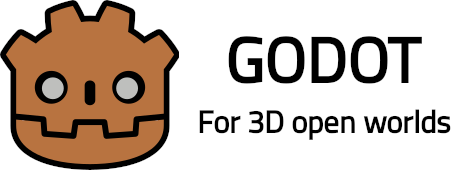

# Godot for 3D open worlds

<p align="center">
    
</p>

This flavor of Godot engine is made to accomodate large open-world 3D games which require
much further view distance than original Godot offers while still relying on single-precision
floats. In order to achieve this a few tweaks were made.

This fork is regularly synchronized with [3.x branch](https://github.com/godotengine/godot/tree/3.x).

Available for Windows x86-64, Linux x86 and x86-64, Linux armv8 (32 bit), Android armv7 and armv8.

Implemented tweaks:
* Logarithmic depth is written in fragment shader as only reliable option with some FPS sacrifice.
* Implemented for both GLES2 and GLES3.
* Far plane maximum is at 9e18. Near and far planes are adjustable.
* Increased editor zoom out distance to match far plane.
* Increased editor zoom increment for faster zooming.

Suggested:
* LOD add-on is welcomed since no object will be culled from rendering at distance.
* Do not make objects larger than 9e18 units (raises error: 
Cannot represent X as 64-bit integer, provided value is too big).

To-do:
* Implement logarithmic depth for all shaders, post-processes, shadows and light.

Not working (properly) as of yet:
* Shadows, post-processes, lights may (and most likely will) misbehave. Trying to fix.
* Editor controls jitter and jump around due to single-precision floats being used.  
In order to tackle this you may want to avoid ortho view and split your global  
coordinate system (3D space) into smaller ones and put scene objects into them.


More details about logarithmic depth at https://github.com/godotengine/godot-proposals/issues/3539.

## Installation
Binaries available for Linux, Windows and Android.
You can download binaries and templates (debug) at [releases](https://github.com/roalyr/godot-for-3d-open-worlds/releases/).
You can build it from source. Refer to `rebuild_` scripts in root folder for convenience.

Reminder for cross-compiling for Windows:
```
To use posix mode for mingw by default:

$ sudo update-alternatives --config x86_64-w64-mingw32-gcc
<choose x86_64-w64-mingw32-gcc-posix from the list>
$ sudo update-alternatives --config x86_64-w64-mingw32-g++
<choose x86_64-w64-mingw32-g++-posix from the list>
```

<br/><br/>
<br/><br/>
<br/><br/>

# Godot Engine original readme

<p align="center">
  <a href="https://godotengine.org">
    
  </a>
</p>

## 2D and 3D cross-platform game engine

**[Godot Engine](https://godotengine.org) is a feature-packed, cross-platform
game engine to create 2D and 3D games from a unified interface.** It provides a
comprehensive set of [common tools](https://godotengine.org/features), so that users can focus on making games
without having to reinvent the wheel. Games can be exported with one click to a
number of platforms, including the major desktop platforms (Linux, macOS,
Windows), mobile platforms (Android, iOS), as well as Web-based platforms
(HTML5) and
[consoles](https://docs.godotengine.org/en/latest/tutorials/platform/consoles.html).

## Free, open source and community-driven

Godot is completely free and open source under the very permissive [MIT license](https://godotengine.org/license).
No strings attached, no royalties, nothing. The users' games are theirs, down
to the last line of engine code. Godot's development is fully independent and
community-driven, empowering users to help shape their engine to match their
expectations. It is supported by the [Software Freedom Conservancy](https://sfconservancy.org/)
not-for-profit.

Before being open sourced in [February 2014](https://github.com/godotengine/godot/commit/0b806ee0fc9097fa7bda7ac0109191c9c5e0a1ac),
Godot had been developed by [Juan Linietsky](https://github.com/reduz) and
[Ariel Manzur](https://github.com/punto-) (both still maintaining the project) for several
years as an in-house engine, used to publish several work-for-hire titles.


## Getting the engine

### Binary downloads

Official binaries for the Godot editor and the export templates can be found
[on the homepage](https://godotengine.org/download).

### Compiling from source

[See the official docs](https://docs.godotengine.org/en/latest/development/compiling/)
for compilation instructions for every supported platform.

## Community and contributing

Godot is not only an engine but an ever-growing community of users and engine
developers. The main community channels are listed [on the homepage](https://godotengine.org/community).

The best way to get in touch with the core engine developers is to join the
[Godot Contributors Chat](https://chat.godotengine.org).

To get started contributing to the project, see the [contributing guide](CONTRIBUTING.md).

## Documentation and demos

The official documentation is hosted on [ReadTheDocs](https://docs.godotengine.org).
It is maintained by the Godot community in its own [GitHub repository](https://github.com/godotengine/godot-docs).

The [class reference](https://docs.godotengine.org/en/latest/classes/)
is also accessible from the Godot editor.

We also maintain official demos in their own [GitHub repository](https://github.com/godotengine/godot-demo-projects)
as well as a list of [awesome Godot community resources](https://github.com/godotengine/awesome-godot).

There are also a number of other
[learning resources](https://docs.godotengine.org/en/latest/community/tutorials.html)
provided by the community, such as text and video tutorials, demos, etc.
Consult the [community channels](https://godotengine.org/community)
for more information.

[](https://github.com/godotengine/godot/actions)
[](https://www.codetriage.com/godotengine/godot)
[](https://hosted.weblate.org/engage/godot-engine/?utm_source=widget)
[](https://www.tickgit.com/browse?repo=github.com/godotengine/godot)
